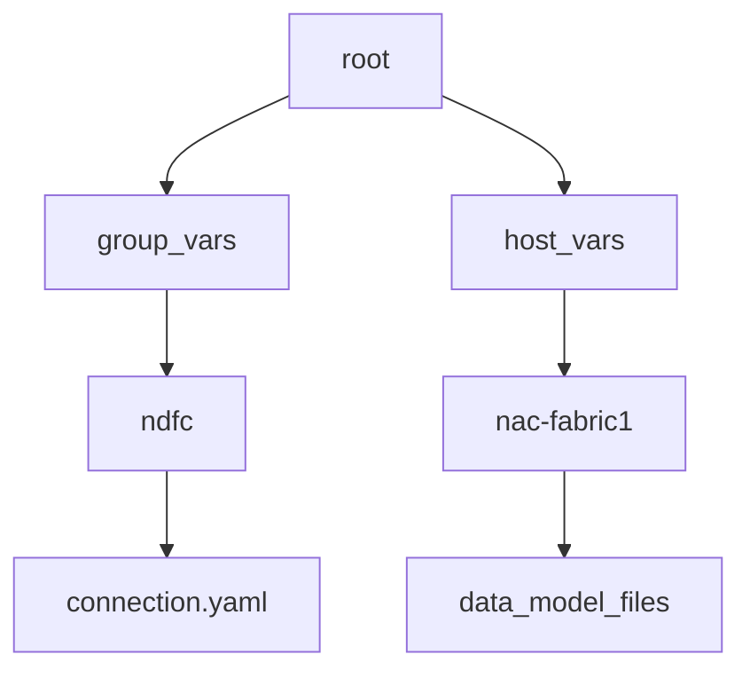

# Ansible NDFC VXLAN Example Repository

This repository is designed to build the skeleton for the [Network as Code DC VXLAN Ansible Galaxy Collection](https://galaxy.ansible.com/ui/repo/published/cisco/nac_dc_vxlan/). Cloning this repository will create a working structure that can be extended to automate your Cisco Nexus Data Center network using Nexus Dashboard Fabric Controller (NDFC).

## Setting up environment for the collection

Installation of a Python virtual environment is needed in order to install the collection and it's requirements. We recommend [pyenv](https://github.com/pyenv/pyenv) which provides a robust Python virtual environment capability that also allows for management of different Python versions. The following instructions are detailed around using pyenv. For pipeline execution please refer to the *pipeline section* which is documented at container level.

### Step 1 - Installing the example repository

To simplify getting started with this collection we are providing you with an [example repository](https://github.com/netascode/ansible-dc-vxlan-example) that you can clone from GitHub.  This repository creates the required skeleton structure including examples for pipelines. Cloaning this repository requires the installation of [git client](https://git-scm.com/downloads) which is available for all platforms.

Run the following command in the location of interest.

```bash
git clone https://github.com/netascode/ansible-dc-vxlan-example.git nac-vxlan
```

This will clone the repository into the directory nac-vxlan.

### Step 2 - Create the virtual environment with pyenv

In this directory create a new virtual environment and install a Python version of your choice. At the _time of writting_, a commonly used version is Python version 3.10.13.  Command `pyenv install 3.10.13` will install this version. For detailed instructions please visit the [pyenv](https://github.com/pyenv/pyenv) site.

```bash
cd nac-vxlan
pyenv virtualenv <Python_version> nac-ndfc
pyenv local nac-ndfc
```

Executing command `pyenv local <env_name>` sets the environment so that whenever the directory is entered it will change into the right virtual environment.

### Step 3 - Install Ansible and additional required tools

Included in the example repository is the requirements file to install Ansible. First upgrade PIP to latest version.

```bash
pip install --upgrade pip
pip install -r requirements.txt
```

### Step 4 - Install Ansible Galaxy Collection (default placement)

The default placement for Ansible Galaxy Collections is in your home directory under `.ansible/collections/ansible_collections/`. To install the collection in the default location run the following command:

```bash
ansible-galaxy collection install -r requirements.yaml
```

### Step 5 - Install Ansible Galaxy Collection (non-default placement)

If you wish to install the Galaxy Collection inside the repository you are creating with this example repository, you can run the following command:

```bash
ansible-galaxy collection install -p collections/ansible_collections/ -r requirements.yaml
```

You will need to then configure your ansible.cfg file to point to the correct collection location. 

This sets the correct path for all the Python modules and libraries in the virtual environment that was created. If you look in that directory you will find the collections package locations. Below is the base `ansible.cfg` file. You will need to adjust the `collections_path` to your environment paths:

```bash
[defaults]
collections_path = ./collections/ansible_collections/

```

### Step 6 - Change Ansible callbacks

If you wish to add any ansible callbacks ( the listed below expand on displaying time execution ) you can add the following to the `ansible.cfg` file:

```ini
callback_whitelist=ansible.posix.timer,ansible.posix.profile_tasks,ansible.posix.profile_roles
callbacks_enabled=ansible.posix.timer,ansible.posix.profile_tasks,ansible.posix.profile_roles
bin_ansible_callbacks = True
```

### Step 7 - Verify the installation

Verify that the ansible configuration file is being read and all the paths are correct inside of this virtual environment. 

```bash
ansible --version
```

Your output should be similar to the output below

```bash
ansible [core 2.16.3]
  config file = /Users/username/tmp/nac-vxlan/ansible.cfg
  configured module search path = ['/Users/username/.ansible/plugins/modules', '/usr/share/ansible/plugins/modules']
  ansible python module location = /Users/username/.pyenv/versions/3.10.13/envs/nac-ndfc/lib/python3.10/site-packages/ansible
  ansible collection location = /Users/username/path/to/collections/ansible_collections
  executable location = /Users/username/.pyenv/versions/nac-ndfc/bin/ansible
  python version = 3.10.13 (main, Oct 29 2023, 00:04:17) [Clang 15.0.0 (clang-1500.0.40.1)] (/Users/username/.pyenv/versions/3.10.13/envs/nac-ndfc/bin/python3.10)
  jinja version = 3.1.4
  libyaml = True
```

## Inventory host files

As is standard with Ansible best practices, inventory files provide the destination targets for the automation. For this collection, the inventory file is a YAML file that contains the information about the devices that are going to be configured. The inventory files is called `inventory.yaml` and is located in the root of the repository.

The inventory file is going to contain a structure similar to this:

```yaml
---
all:
  children:
    ndfc:
      hosts:
        nac-fabric1:
          ansible_host: 10.X.X.X
        nac-fabric1-ipv6:
          ansible_host: "[2001:XXX:XXXX:XXXX::XX]"
```

> [!NOTE]
> For IPv6 the ansible_host must be formated like the example above
> "[ipv6 address]"

This structure creates two things in Ansible:
  * A group called `ndfc`
  * A host called `nac-fabric1`

These are tied back to the directory structure of the repository that contains two folders in the top directory:



The data model **must** exist under the `host_vars` directory structure. The inventory file organizes how the variables are read using both `group_vars` and `host_vars` directories. Under `group_vars` is where you populate the `connection.yaml` file which stores the credential information for the NDFC controller.

The collection is **pre-built** to make use of the `group_vars` and `host_vars` data and matches what is already constructed in the repository. There is a 1:1 relationship between the code in the repository and the NDFC fabric. For more complex environments, the inventory file can be expanded to include multiple groups and hosts including managment of multi-site fabrics which is explained in a separate document.

### Step 1 - Update the inventory file

In the provided `inventory.yaml` file in the root directory, update the `ansible_host` variable to point to your NDFC controller by replacing `10.X.X.X` with the IP address of the NDFC controller.

### Step 2 - Configure ansible connection file

In the directory `group_vars/ndfc` is a file called `connection.yaml` that contains example data:

```yaml
---
# Connection Parameters for 'ndfc' inventory group
#
# Controller Credentials
ansible_connection: ansible.netcommon.httpapi
ansible_httpapi_port: 443
ansible_httpapi_use_ssl: true
ansible_httpapi_validate_certs: false
ansible_network_os: cisco.dcnm.dcnm
# NDFC API Credentials
ansible_user: "{{ lookup('env', 'ND_USERNAME') }}"
ansible_password: "{{ lookup('env', 'ND_PASSWORD') }}"
# Credentials for switches in inventory
ndfc_switch_username: "{{ lookup('env', 'NDFC_SW_USERNAME') }}"
ndfc_switch_password: "{{ lookup('env', 'NDFC_SW_PASSWORD') }}"

```

This file contains the connection parameters required for reachability to the NDFC controller. The `ansible_user`, and `ansible_password` credentials must be set to establish a connection to the NDFC controller. For the devices, you will set the `ndfc_switch_username` and `ndfc_switch_username` variables which can also be configured as environment variables. Environment variables provide extra security so that the credentials are not stored in plain text inside the repository. Accidentaly including your credentials in a repository is a very difficult to remove. Hence, the usage of environment variables is recommended as a starting point.

Additionally, if a pipeline is required, the environment variables can be stored in the pipeline configuration using secure methods and prevents them from being exposed in the repository.

[Ansible vault](https://docs.ansible.com/ansible/latest/vault_guide/index.html) can also be used to encrypt the contents of the connection file or simply encrypt the variables.

### Step 3 - Set environment variables

The environment variables should be set in the shell where the playbook is executed. They are configured via the `export` command in the shell (bash). Using this template set the environment variables to the correct credentials for the NDFC controller and the fabric devices that will be managed by NDFC.

```bash
# These are the credentials for ND
export ND_USERNAME=admin
export ND_PASSWORD=Admin_123
# These are the credentials for the devices in the inventory
export NDFC_SW_USERNAME=admin
export NDFC_SW_PASSWORD=Admin_123
```

## Understanding our Ansible roles

### Validate role

Role: [cisco.nac_dc_vxlan.validate](https://github.com/netascode/ansible-dc-vxlan/blob/develop/roles/validate/README.md)

The `validate` role ensures that the data model is correct and that the data model can be processed by the subsequent roles. The validate role reads all the files in the `host_vars` directory and create a single data model in memory for execution.

As part of the VXLAN as Code service from Cisco, you will also be able to utilize the semantic validation feature to make sure that the data model matches the intended expected values. This is a powerful feature that allows you to ensure that the data model is correct before it is deployed to the network. Additonally the validate role allows creation of rules that can be used to prevent operators from making specific configurations that are not allowed in the network. These can be as simple as enforcing proper naming conventions to more complex rules for interconnectivity issues that should be avoided. These rules are coded in Python and can be constructed as part of the Services as Code offer. 

### Create role

Role: [cisco.nac_dc_vxlan.dtc.create](https://github.com/netascode/ansible-dc-vxlan/blob/develop/roles/dtc/create/README.md)

The `create` role builds all of the templates and variable parameters required to deploy the VXLAN fabric and creates fabric state in NDFC. The data model is converted into the proper templates required by the Ansible modules used to communicate with the NDFC controller and manage the fabric state.

### Deploy role

Role: [cisco.nac_dc_vxlan.dtc.deploy](https://github.com/netascode/ansible-dc-vxlan/blob/develop/roles/dtc/deploy/README.md)

The `deploy` role deploys the fabric state created using the Create role to the NDFC managed devices.

### Remove role

Role: [cisco.nac_dc_vxlan.dtc.remove](https://github.com/netascode/ansible-dc-vxlan/blob/develop/roles/dtc/remove/README.md)

The `remove` role removes state from the NDFC controller and the devices managed by the NDFC controller. When the collection discoveres managed state in NDFC that is not defined the the data model it gets removed by this role.  For this reason this role requires the following variables to be set to `true` under the `group_vars` directory. This avoids accidental removal of configuration from NDFC that might impact the network.

Inside the example repository under `group_vars/ndfc` is a file called `ndfc.yaml` that contains the variables:

```yaml
# Control Parameters for 'Remove' role tasks in VXLAN EVPN, External, and ISN fabrics
edge_connections_delete_mode: false
interface_delete_mode: false
inventory_delete_mode: false
link_fabric_delete_mode: false
link_vpc_delete_mode: false
network_delete_mode: false
policy_delete_mode: false
vpc_delete_mode: false
vrf_delete_mode: false

# Control Parameters for 'Remove' role tasks in Multisite fabric
multisite_child_fabric_delete_mode: false
multisite_network_delete_mode: false
multisite_vrf_delete_mode: false
```

**Note:** These variables are set to `false` by default to avoid accidental removal of configuration from NDFC that might impact the network. 

### Advantages of the roles in the workflow

These roles when run in sequence (validate, create, deploy, remove) are designed to build out the entire fabric and can be executed by a pipeline.  The roles can also be run in isolation by simply commenting out the roles that are not required during testing and fabric buildout to validate incremental changes.

## Building the primary playbook

The following playbook for the NDFC as Code collection is the central execution point for this collection. Compared to automation in other collections, this playbook is designed to be mostly static and typically will not change. What gets executed during automation is based entirely on changes in the data model. When changes are made in the data model, the playbook will call the various roles and underlying modules to process the changes and update the NDFC managed fabric.

The playbook is located in the root of the repository and is called `vxlan.yaml`. It contains the following:

```yaml
---
# This is the main entry point playbook for calling the various
# roles in this collection.
- hosts: nac-fabric1
  any_errors_fatal: true
  gather_facts: false

  roles:
    # Prepare service model for all subsequent roles
    #
    - role: cisco.nac_dc_vxlan.validate

    # -----------------------
    # DataCenter Roles
    #   Role: cisco.netascode_dc_vxlan.dtc manages direct to controller NDFC workflows
    #
    - role: cisco.nac_dc_vxlan.dtc.create
      tags: 'role_create'

    - role: cisco.nac_dc_vxlan.dtc.deploy
      tags: 'role_deploy'

    - role: cisco.nac_dc_vxlan.dtc.remove
      tags: 'role_remove'
```

The `host` is defined as nac-fabric1 which references back to the `inventory.yaml` file. The `roles` section is where the various collection roles are called.

The first role is `cisco.nac_dc_vxlan.validate` which is going to validate the data model. This is a required step to ensure that the data model is correct and that the data model is going to be able to be processed by the subsequent roles.

The subsequent roles are the `cisco.nac_dc_vxlan.dtc.create`, `cisco.nac_dc_vxlan.dtc.deploy`, and `cisco.nac_dc_vxlan.dtc.remove` roles. These roles are the primary roles that will invoke changes in NDFC as described earlier.


> **Note**: For your safety as indicated ealier, the `remove` role also requires setting some variables to `true` under the `group_vars` directory. This is to avoid accidental removal of configuration from NDFC that might impact the network. This will be covered in more detail below.

The playbook can be configured to execute only the roles that are required. For example, as you are building your data model and familiarizing yourself with the collection, you may comment out the `deploy` and `remove` roles and only execute the `validate` and `create` roles. This provides a quick way to make sure that the data model is structured correctly.

------
**Role Level Tags:**

To speed up execution when only certain roles need to be run the following role level tags are provided:

 * role_validate - Select and run `cisco.nac_dc_vxlan.validate` role
 * role_create - Select and run `cisco.nac_dc_vxlan.create` role
 * role_deploy  - Select and run `cisco.nac_dc_vxlan.deploy` role
 * role_remove  - Select and run `cisco.nac_dc_vxlan.remove` role

The validate role will automatically run if tags `role_create, role_deploy, role_remove` are specified.

Example: Selectively Run `cisco.nac_dc_vxlan.create` role alone

```bash
ansible-playbook -i inventory.yaml vxlan.yaml --tags role_create
```

## Service Model Data

The following sample data is available under the `host_vars/nac-fabric1` directory in this repository.  This data can be used to build out your first fabric using this collection.

### Global configuration

This data is defined in `host_vars/nac-fabric1/global.nac.yaml` and contains the global parameters for the VXLAN fabric.

```yaml
---
vxlan:
  fabric:
    name: nac-fabric1
    type: VXLAN_EVPN
  global:
    bgp_asn: 65001
    route_reflectors: 2
    anycast_gateway_mac: 12:34:56:78:90:00
    dns_servers:
      - ip_address: 10.0.0.2
        vrf: management
    ntp_servers:
      - ip_address: 10.55.0.2
        vrf: management
```

### Topology inventory configuration

This data is defined in `host_vars/nac-fabric1/topology_switches.nac.yaml` and contains the base topology inventory for switches in the fabric.

```yaml
---
vxlan:
  topology:
    switches:
      - name: netascode-spine1
        serial_number: 99H2TUPCVFK
        role: spine
        management:
          default_gateway_v4: 10.1.1.1
          management_ipv4_address: 10.1.1.21
        routing_loopback_id: 0
        vtep_loopback_id: 1
      - name: netascode-spine2
        serial_number: 941L30Q8ZYI
        role: spine
        management:
          default_gateway_v4: 10.1.1.1
          management_ipv4_address: 10.1.1.22
        routing_loopback_id: 0
        vtep_loopback_id: 1
      - name: netascode-leaf1
        serial_number: 9LWGEUPJOCM
        role: leaf
        management:
          default_gateway_v4: 10.1.1.1
          management_ipv4_address: 10.1.1.11
        routing_loopback_id: 0
        vtep_loopback_id: 1
      - name: netascode-leaf2
        serial_number: 9YEXD0OHA7Z
        role: leaf
        management:
          default_gateway_v4: 10.1.1.1
          management_ipv4_address: 10.1.1.12
        routing_loopback_id: 0
        vtep_loopback_id: 1
      - name: netascode-leaf3
        serial_number: 9M2TXMZ7D3N
        role: leaf
        management:
          default_gateway_v4: 10.1.1.1
          management_ipv4_address: 10.1.1.13
        routing_loopback_id: 0
        vtep_loopback_id: 1
      - name: netascode-leaf4
        serial_number: 982YGMKUY2B
        role: leaf
        management:
          default_gateway_v4: 10.1.1.1
          management_ipv4_address: 10.1.1.14
        routing_loopback_id: 0
        vtep_loopback_id: 1
```

### Underlay configuration

This data is defined in `host_vars/nac-fabric1/underlay.nac.yaml` and contains the underlay settings for the fabric.

```yaml
---
vxlan:
  underlay:
    general:
      routing_protocol: ospf
      enable_ipv6_underlay: false
      replication_mode: multicast
      fabric_interface_numbering: p2p
      subnet_mask: 31
      underlay_routing_loopback_id: 0
      underlay_vtep_loopback_id: 1
      underlay_routing_protocol_tag: UNDERLAY
      underlay_rp_loopback_id: 250
      intra_fabric_interface_mtu: 9216
      layer2_host_interface_mtu: 9216
      unshut_host_interfaces: true
    ipv4:
      underlay_routing_loopback_ip_range: 10.0.0.0/22
      underlay_vtep_loopback_ip_range: 10.100.100.0/22
      underlay_rp_loopback_ip_range: 10.250.250.0/24
      underlay_subnet_ip_range: 10.1.0.0/16
    ipv6:
      enable_ipv6_link_local_address: false
      underlay_subnet_mask: 64
    ospf:
      area_id: 0.0.0.0
      authentication_enable: false
      authentication_key_id: 0
      authentication_key: ""
    multicast:
      underlay_rp_loopback_id: 250
      underlay_primary_rp_loopback_id: 0
```

### VRF configuration

This data is defined in `host_vars/nac-fabric1/vrfs.nac.yaml` and contains the overlay VRF data.

```yaml
---
vxlan:
  overlay:
    vrfs:
      - name: NaC-VRF01
        vrf_id: 150001
        vlan_id: 2001
        attach_group: all
      - name: NaC-VRF02
        vrf_id: 150002
        vlan_id: 2002
        attach_group: leaf1
      - name: NaC-VRF03
        vrf_id: 150003
        vlan_id: 2003
        attach_group: leaf2
    vrf_attach_groups:
      - name: all
        switches:
          - { hostname: netascode-leaf1 }
          - { hostname: netascode-leaf2 }
          - { hostname: netascode-leaf3 }
          - { hostname: netascode-leaf4 }
      - name: leaf1
        switches:
          - { hostname: netascode-leaf1 }
      - name: leaf2
        switches:
          - { hostname: netascode-leaf2 }
      - name: leaf3
        switches:
          - { hostname: netascode-leaf3 }
      - name: leaf4
        switches:
          - { hostname: netascode-leaf4 }
```


### Network configuration

This data is defined in `host_vars/nac-fabric1/networks.nac.yaml` and contains the overlay Network data.

```yaml
---
vxlan:
  overlay:
    networks:
      - name: NaC-Net01
        vrf_name: NaC-VRF01
        net_id: 130001
        vlan_id: 2301
        vlan_name: NaC-Net01_vlan2301
        gw_ip_address: "192.168.12.1/24"
        attach_group: all
      - name: NaC-Net02
        vrf_name: NaC-VRF02
        net_id: 130002
        vlan_id: 2302
        vlan_name: NaC-Net02_vlan2302
        gw_ip_address: "192.168.12.2/24"
        attach_group: leaf1
      - name: NaC-Net03
        vrf_name: NaC-VRF03
        net_id: 130003
        vlan_id: 2303
        vlan_name: NaC-Net03_vlan2303
        gw_ip_address: "192.168.12.3/24"
        gw_ipv6_address: "2001::1/64"
        route_target_both: True
        l3gw_on_border: True
        mtu_l3intf: 7600
        int_desc: "Configured by NetAsCode"
        attach_group: leaf2
    network_attach_groups:
      - name: all
        switches:
          - { hostname: netascode-leaf1, ports: [Ethernet1/13, Ethernet1/14] }
          - { hostname: netascode-leaf2, ports: [Ethernet1/13, Ethernet1/14] }
      - name: leaf1
        switches:
          - { hostname: netascode-leaf1, ports: [] }
      - name: leaf2
        switches:
          - { hostname: netascode-leaf2, ports: [] }
```

## Running the Playbook

Run the playbook using the following command:

```bash
ansible-playbook -i inventory.yaml vxlan.yaml
```

The data in `host_vars/nac-fabric1` will be processed by the main `vxlan.yaml` playbook and do the following:

* Create a fabric called `nac-fabric1` using the data from `global.nac.yaml` and `underlay.nac.yaml` files.
* Add 2 Spine and 4 Leaf devices using the data defined in the `topology_switches.nac.yaml` file.
* Add 3 VRFs and 3 Networks using the data defined in `vrfs.nac.yaml` and `networks.nac.yaml` files.
